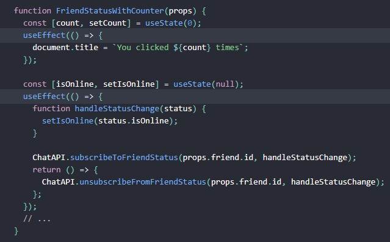

# **REACT HOOKS**

**Hooks are the features in React, which allows you to use React features without having to write a class**<br>
**Hooks don't work inside classes**

## **Why Hooks?**

### **Reason 1**

- limitations in "this" keyword in JavaScript.
- binding of event handlers in class components.
- unreliable Hot Realoads.

### **Reason 2**

- no particular way to reuse stateful components.
- HOC & render props patterns address this problems but hard to refactor.
- Need to share statefull logic in a better way.

### **Reason 3**

- components for data fetching and subscribing to events codes is not organized and scattered in different life-cycle methods.

---

---

## **Day 1**:

`27/12/22`

## **UseState Hook:**

The useState Hook can be used to keep **_track of_** strings, numbers, booleans, arrays, objects, and any combination of these! We could create multiple state Hooks to track individual values.
<br><br>

<br>
**_useState()_ hook:**<br>
`const [count, setCount] = useState(0);`<br>

    Only call HOOKS on the TOP level.
    Don't Call HOOks into condition, or nested functions.
    Only call hooks from React Functions (not from JS components)

- _implemented StateCounter.js_

---

<br><br>

<br>
**_useState()_ with previous state value:**<br>

Passing previous state is unsafe when used in a function so instead pass it through function to a State setter.<br>

**Previously**:<br>
`<button onClick={() => { setCount(count - 1) }} Decrement </button>`<br>
**Now**:<br>
`<button onClick={() => { setCount(prevCount => prevCount + 1) }} Decrement </button>`

- _implemented StateCounter2.js_

---

<br><br>

<br>
**_useState()_ with Objects:**<br>
useState doesn't merge and update state automatically, it has to be done manually by using **_spread operator_**.

**Previously**:<br>

```
<input
          type="text"
          value={name.firstName}
          onChange={(e) => setName({ firstName: e.target.value })}
        />
```

In this it create new object washing out old stored value.

**Now**:<br>

```
<input
          type="text"
          value={name.firstName}
          onChange={(e) => setName({...name, firstName: e.target.value })}
        />
```

In this it copies old stored value and update new values in it.<br>
Called **_Spread Operator_**

- _implemented StateCounter3.js_

---

<br><br>

<br>
**_useState()_ with Arrays:**<br>
we can simply create arrays like object

```
const [items, setItems] = useState([]);

  const addItem = () => {
    setItems([
      ...items,
      {
        id: items.length,
        value: Math.floor(Math.random() * 10) + 1,
      },
    ]);
  };
```

- _implemented StateCounter4.js_

---

### **_Note:_**

- When dealing with objects or arrays, always make sure to 'spread' your state variable and then call the setter function.

---

---

## **UseEffect Hook:**

The Effect Hook lets you perform **_side effects_** in functional components.<br>
It is close replacement for componentDidMount, componentDidUpdate and componentWillUnmount.
<br><br>

<br>
**_useState()_ after render:**<br>
Creating component metioned above:

- componentDidMount
- componentDidUpdate
- componentWillUnmount

UseEffect runs after every render of the component.

```
  useEffect(() => {
    document.title = `You Clicked ${count} times`;
  });
```

- _implemented EffectCounter.js_

---

<br><br>

<br>
**_useEffect()_ conditionally run efffects:**<br>
Last time we saw that "UseEffect runs after every render of the component."<br>
To counter this React team implemented **_another parameter_** in useEffect()<br>
i.e. `an Array []`

```
useEffect(() => {
  console.log("useEffect - Updating document title");
  document.title = `You Clicked ${count} times`;
}, [count]);
```

Which checks that parameter if it changes then it runs the render.

- _implemented EffectCounter2.js_

---

<br><br>

<br>
**_useEffect()_ Run effects only once:**<br>
By simple adding an empty Array we can command react to render it once

```
useEffect(() => {
  console.log("useEffect called");
  window.addEventListener("mousemove", logMousePosition);
}, []);
```

- _implemented EffectMouse.js_

---

<br><br>

<br>
**_useEffect()_ with clean up:**<br>
In the MouseContainer when we toggle off the events then too the Mouse events are logged. To counter this we had to clean up the events that means we have to unsubbscribe all the events,timers and function.<br>
In **_componentWillUnmount()_** function we set the clean up function which can be performed in useEffect by adding a **_return()_** function to it.

```
  useEffect(() => {
    console.log("useEffect called");
    window.addEventListener("mousemove", logMousePosition);

    return () => {
      console.log("Component unmounted");
      window.removeEventListener("mousemove", logMousePosition);
    };
  }, []);
```

- _implemented EffectMouseContainer.js_
- _implemented EffectMouse.js_

---

<br><br>

<br>
**_useEffect()_ with Incorrect Dependency:**<br>
When setting up counter we have to render it once so with put an empty string into the useEffect Dependency.
But useEffect Dependency is created to look out for the changes occured in the dependency in our change **_"count"_**.

```
const [count, setCount] = useState(0);

  const tick = () => {
    setCount(count + 1);
  };

  useEffect(() => {
    const interval = setInterval(tick, 1000);
    return () => {
      clearInterval(interval);
    };
  }, [count]);
```

How ever we can use the second method to implement without setting dependency where we use 2nd learnings from [useState](#usestate-hook):

```
const [count2, setCount2] = useState(0);

  const tick2 = () => {
    setCount2((prevCount) => prevCount + 1);
  };

  useEffect(() => {
    const interval2 = setInterval(tick2, 1000);
    return () => {
      clearInterval(interval2);
    };
  }, []);
```

### **_Note:_**

- Whenever we want to call a function in **_useEffect_** it is best to add whole function into the useEffect function.

```
  useEffect(() => {
    function doSomething() {
      console.log(someProp);
    }
    const interval2 = setInterval(tick2, 1000);
    return () => {
      clearInterval(interval2);
    };
  }, [someProp]);
```

- In class component we put related code into different life-cycle and unrelated code into same life cycle, so we can use multiple useEffect calls into the same component. If you have multiple effects to run, make sure you separate it out rather than having all the code in a single uesEffect.<br>
  

- _implemented EffectIntervalCounter.js_

---

<br><br>
<br>
**Fecthing data with _useEffect()_:**<br>
first of all install axios.

### **_Note:_**

- In Future, Suspense will be incharge for data fetching.<br>

But by fetching data with **_useState() & useEffect()_** help understanding it more.<br>

Check this files to understand it thoroughly:

- _implemented EffectDataFetching.js_

1st: Fetch 1:<br>
Here we fetch all 100 posts

2nd: Fetch 2:<br>
Placed an input field and **_onChange()_** to it we fetch only one post by given **_id_**

3rd: Fetch 3:<br>
Same as above instead used Button to fetch it

---

---

## **UseContext Hook:**
